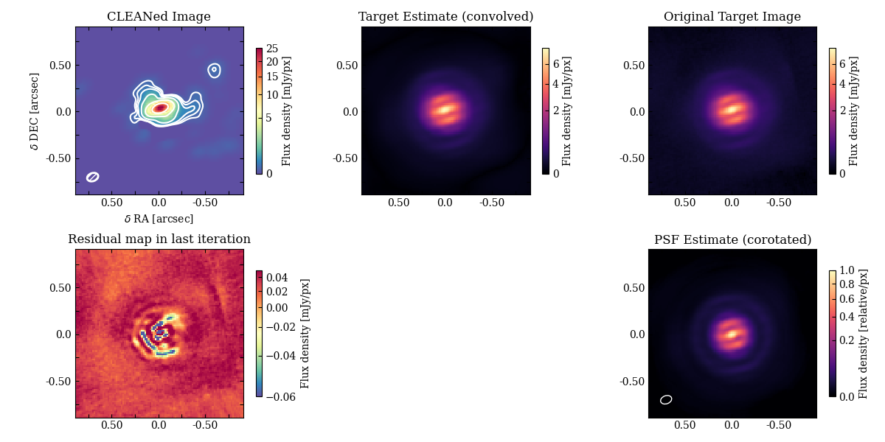

# LIZARD Pipeline (LBT Interferometer fiZeAu Reduction of Data Pipeline)

Data reduction tools (and pipeline) for LBTI Fizeau imaging. This is actively evolving, so please do not hesitate to reach out with questions.

## Requirements

### Dependencies

As of 21 October 2024, compatible with latest version of each.

- Astropy
- Scipy
- pandas
- numpy
- matplotlib
- scikit-image

### Disk Space

Note that Fizeau lucky image includes large amounts of data. 10s or 100s of thousands of raw images make up a raw data set. An example observing night from April 2024 contains 45 GB of raw images. LIZARD produces approximately 15 GB of intermediate and final products during data processing.

## Usage
### TLDR

You can run the pipeline by first calling 

```
lizard.py reduce /path/to/target_config.json
```

and then 

```
lizard.py calibrate /path/to/calibration_config.json
``` 

Details on the format of these config files are listed below. 


### 0. Set up a config file for each target

See `template_target_config.json` for an example. The fields to edit are

- `target`: the name of the target
- `sub_window`: size of the cutout to use for processing from the raw image (larger values require more disk space and RAM)
- `instrument`: NOMIC or LMIRCam
- `targ_type`: "science" or "calibration"
- `obsdate`: the YYMMDD date used by the LBTI system when naming raw files (please don't rename raw data files!)
- `data_dir`: the directory containing all the raw data (all raw data for a target should be placed in one directory)
- `output_dir`: the path in which to save data products, plots and logs
- `skips`: a list of `nod_info` keys to ignore during processing (default to this being empty)
- `psfname`: takes either "model" | "/path/to/reduced/unrotated_psf.npy", which is an intermediate product of the psf calibrator. Suggested to use "model" for calibrators and then the empirical psf for science targets
- `cutoff_fraction`: percentile of lucky fringing frames to keep (default 0.5, but values from 0.1 to 0.9 are valid; see [Isbell et al. 2024a](https://www.spiedigitallibrary.org/conference-proceedings-of-spie/13095/1309506/The-LBTI-pioneering-the-ELT-era/10.1117/12.3027270.short?tab=ArticleLinkCited)
- `batch_size`: raw images are processed in batches to reduce memory overhead (default 10 nods)
- `nod_info`: a dictionary of format
  ```
  "1": {
      "start": 12000,
      "end": 13999,
      "position": [65, 65],
      "subtract": "2"
    },
  "2": {
      "start": 14000,
      "end": 15999,
      "position": [65, 190],
      "subtract": "1"
    },
  ...,
   "n": {
      "start": 16000,
      "end": 17999,
      "position": [65, 65],
      "subtract": "n-1"
    },
  ```
  where the starting and ending file number for each nodding cycle is specified, along with a rough location of the target within the frame. Finally the `subtract` key specifies which nod to use for background subtraction (usually observations are done in A-B pairs)

### 1. Run the `lizard_reduce.py` script on each target and calibrator

Usage is 
```
lizard.py reduce target_config.json
```
, where `target_config.json` is replaced with your config file.

I suggest processing all calibrators first so that their empirical PSFs can be used for the target reduction.

Included in this step are

1. Background subtraction
2. Frame selection and alignment
3. Image stacking and corotation so that North is up

### 2. Run the `lizard_calibrate.py` script on each target-calibrator pair

Usage is 
```
lizard.py calibrate /path/to/calibration_config.json
```

This process does the following

1. Calculates the final PSF of the stacked+corotated science observations
2. Does flux calibration
3. Does PSF deconvolution using the Hogbom CLEAN algorithm and with Richardson-Lucy deconvolution

For each target-calibrator pair a new config file must be specified. See `template_calibration_config.json` for an example. The fields to edit are

- `target_config`: the path to your target config file
- `calib_config`: the path to your calibrator config file
- `output_dir`: the path in which to save data products, plots and logs
- `obs_wavelength`: the wavelength of the observation
- `flux_cal`: a dictionary of format
  ```
  {"calib_flux_Jy":"valueInJy", "calib_flux_err_Jy":"valueInJy"}
  ```
- `clean_niter`: the number of iterations to run the `CLEAN` deconvolution (default 1e5)
- `clean_gain`: the gain to be used in the `CLEAN` deconvolution (default 1e-3)
- `clean_phat`: the pointy-hat parameter to be used during `CLEAN` deconvolution (default:0.0, useful for extended emission)
- `rl_niter`: the number if iterations to be used during Richardson-Lucy deconvolution (default:32)
- `rl_eps`: the filter epsilon to be used during Richardson-Lucy deconvolution (default: 1e-3)

## Products

The final product of these procedures is a flux calibrated image with the equivalent resolution of a 23 meter telescope. An example is shown in the below figure. The images and their uncertainties/accompanying data are saved as \*.npy binary files or as pickled objects for ease of use.

### Example image (WORK IN PROGRESS, Copyright J. Isbell)


The top left panel is the final science image. The top right panel shows the processed observations before deconvolution. The top center panel shows the final science image at the same resolution as the intial images, for comparison. The bottom left panel is the so-called residual map, which shows the difference between the initial and final images after CLEANING. The bottom right panel shows the PSF used for deconvolution.
